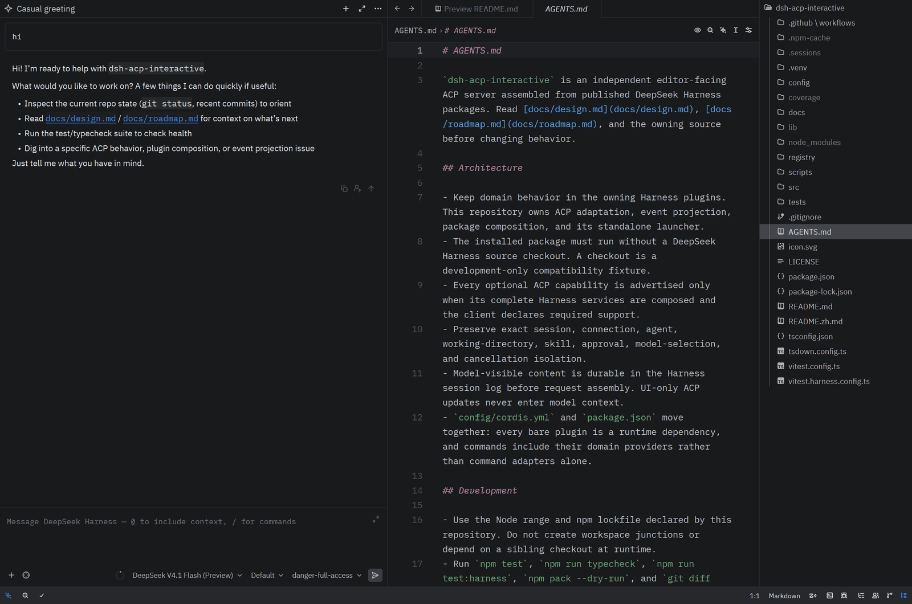
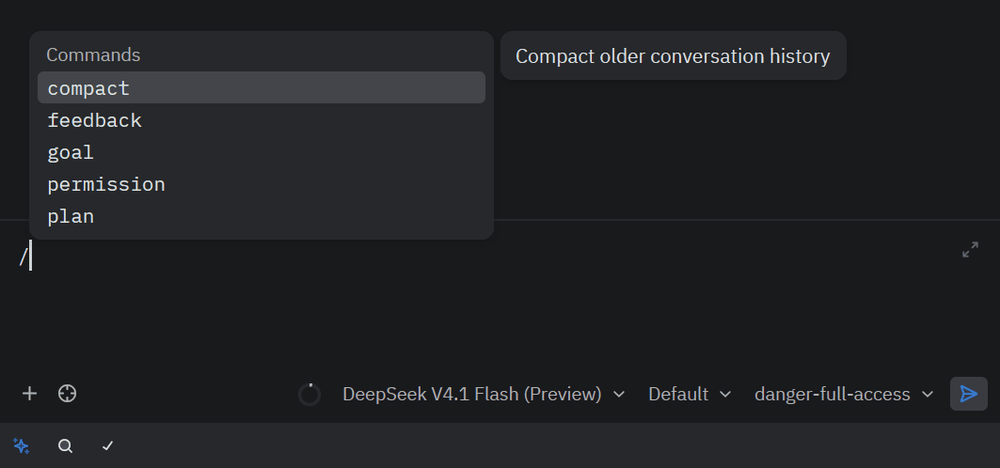
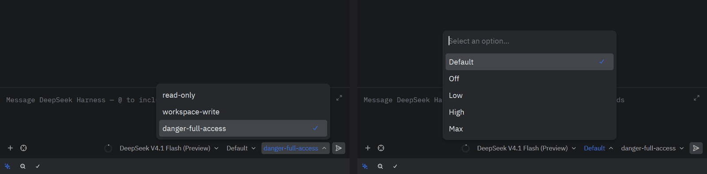
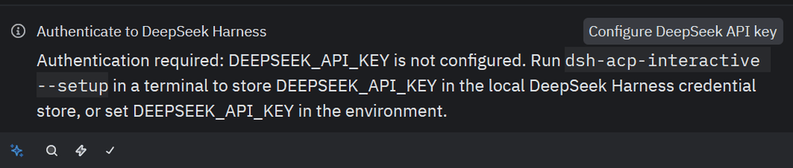
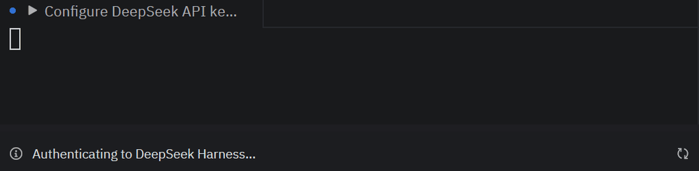
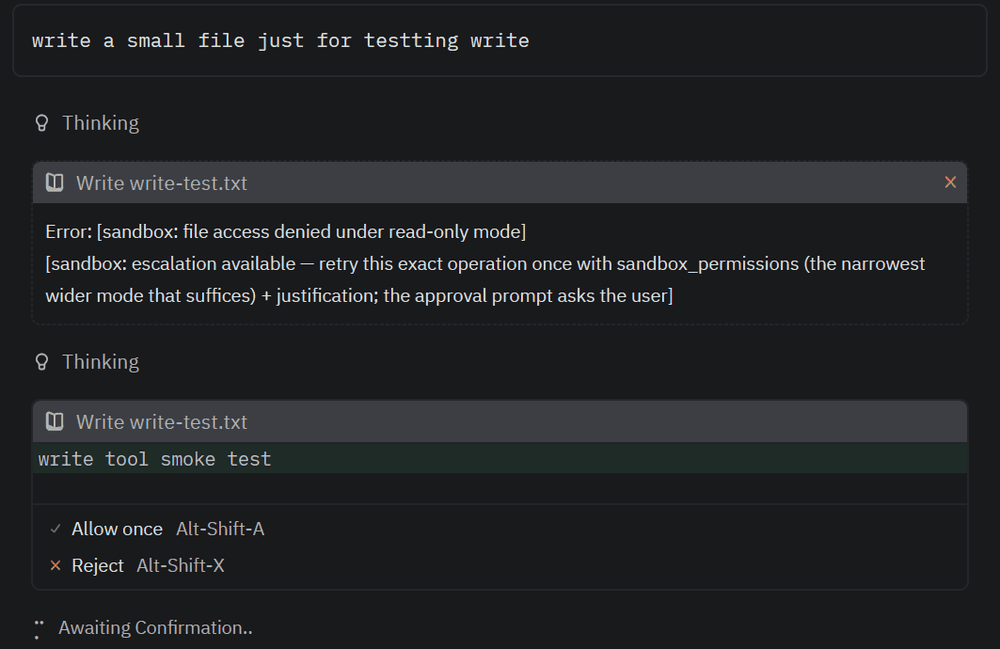
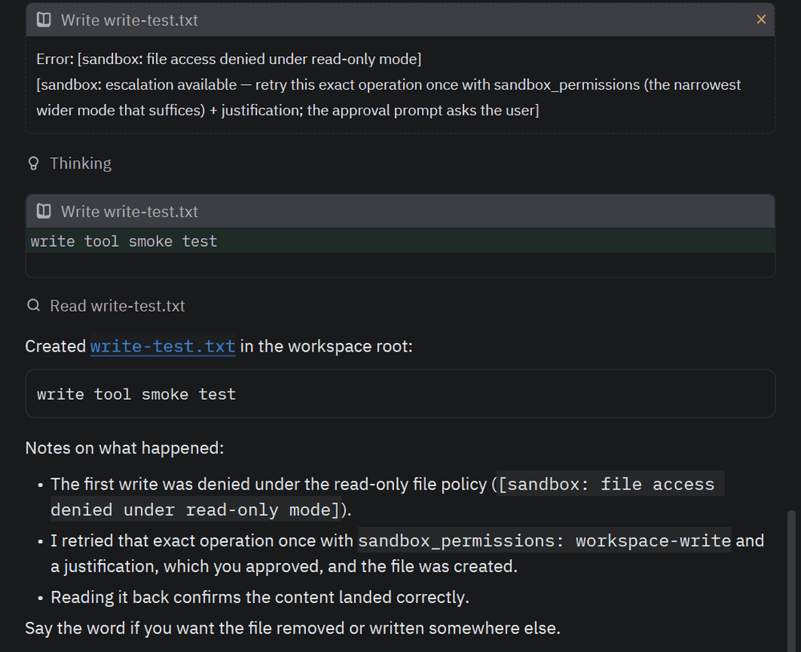

# dsh-acp-interactive

[](https://www.npmjs.com/package/deepseekharness-acp-interactive)
[](https://github.com/ClickPM/dsh-acp-interactive/actions/workflows/ci.yml)
[](https://github.com/ClickPM/dsh-acp-interactive/actions/workflows/registry-auth.yml)
[](LICENSE)

[English](README.md) | 中文

面向编辑器的 Agent Client Protocol JSON-RPC stdio 服务器。它按需创建 dsh agent，并把实时 session 事件投影为 ACP 消息、思考、工具、审批、计划、标题、用量和命令更新。首个兼容目标是 Zed。

本包同时发布 UI transport 插件和 `dsh-acp-interactive` 可执行程序。transport 不承载领域逻辑；可执行程序加载随包发布的完整 Cordis 组合，因此普通用户无需安装或修改 DeepSeek Harness 源码。本 UI bridge 与上游 automation-only ACP transport 相互独立。

`dsh-acp-interactive` 是独立的社区维护项目，与 DeepSeek 和 Zed Industries 没有隶属或背书关系；它把已发布的 `@deepseek-ai/dsh-*` 包组合在经过评审的 editor profile 之后，不自称 DeepSeek 官方 ACP agent。

## 快速开始

```sh
npm install --global deepseekharness-acp-interactive
dsh-acp-interactive --setup
```

`--setup` 通过 Harness 凭据存储保存 `DEEPSEEK_API_KEY`，不会回显。然后在 Zed 的 `settings.json`（按 `Ctrl+Shift+P` / `Cmd+Shift+P` 输入 `zed: open settings` 打开）中登记已安装的命令；Windows 上使用 `where.exe dsh-acp-interactive` 打印的绝对路径（注意使用正斜杠 `/` 或双反斜杠 `\\`），macOS / Linux 上使用 `which dsh-acp-interactive`：

```json
{
  "agent_servers": {
    "dsh-acp-interactive": {
      "type": "custom",
      "command": "C:/Users/you/AppData/Roaming/npm/dsh-acp-interactive.cmd",
      "args": []
    }
  }
}
```

保存后，在 Zed 的 Agent 面板（快捷键 `Ctrl+?` / `Cmd+?`）顶部的 Agent 下拉列表中选择 `dsh-acp-interactive` 即可启用。每个 ACP 客户端都会看到 `Configure DeepSeek API key` 认证方法：支持 terminal authentication 的客户端（包括 Zed）从中打开同一个 `--setup` 流程，其他客户端则以 agent 类型方法收到同样的说明。详见[在 Zed 中运行](#在-zed-中运行)。

## 在 Zed 中的样子



`/` 面板列出从已组合的 Harness 插件中发现的人类命令；权限与推理强度选择器是 ACP session 配置项，分别由 Harness 权限 preset 和所选模型公布的 effort 支撑。





### 认证

没有存储 key 时新开线程，`session/new` 返回 `auth_required`，Zed 随即展示 `Configure DeepSeek API key` 操作和 agent 自己给出的说明。点击后 Zed 以终端任务运行 `--setup`；该终端退出后，Zed 用存好的 key 重试 `session/new`。





### 权限

工具调用在 Harness 沙箱内执行。`read-only` preset 下的写入会被拒绝并附带沙箱的升级提示；重试的调用以 ACP permission request 的形式到达 Zed，给出 `Allow once` / `Reject`，批准后的写入及其回读以工具卡片呈现。





## 1.3.0

`1.3.0` 加入进程内 subagent。组合 profile 现在装配已发布的 `@deepseek-ai/dsh-subagent` 注册表、`spawn` 与 `fork` 两个 backend，以及 `subagent`、`subagent_fork` 两个委托工具：模型把一个独立任务或需要沿用本对话的任务委托出去，并以工具结果收到子 agent 的最终回答，语义与上游完全一致。在 Zed 中，一次委托就是一张工具卡片：子 agent 发布后卡片以委托的 description 作为标题，运行期间子 agent 自己的工具调用、回复、嵌套委托与结算折叠为卡片内有界的 transcript，父 agent 自己的工具结果结算卡片，transcript 保留在结果之前。卡片的 `_meta.dsh_subagent` 记录子 session id，可据此在 sessions 根目录下找到它的日志。

每次委托都在父 turn 内前台等待，因此 `session/cancel`、`session/close` 与连接拆卸都会先停掉子 agent，父 agent 才报告空闲；被取消的委托以失败卡片结算，transcript 以 `Subagent aborted` 结尾，调用结算后不再有任何子事件到达卡片。子 agent 继承父 session 的 sandbox mode，approval 固定为 `never`，并移除 `ask_user_question`，因此子 agent 不会发起 ACP permission request 或提问；升级路径仍归父 agent。子 session 不是编辑器会话：`session/list` 不列出它们，`session/load` 与 `session/resume` 明确拒绝。后台 job、continuable child 与进程外 backend 继续暂缓。见 [In-Process Subagents Agent Note](docs/agent-notes/2026-09-10-in-process-subagents.md)。

## 1.2.0

`1.2.0` 将组合的 DeepSeek Harness 基线从 `0.1.2-rc.1` 移到 `0.1.5-rc.1`，公布的 ACP 能力面不变：ACP SDK 仍固定在 `1.4.0`，`initialize` 的应答与之前完全一致。

上游的 session 格式现为 v3：每次模型 attempt 的 provider 流内嵌进一条耐久结算事件，不再写逐 token 事件，因此实时的文本与推理增量改由 harness 进程内的 `agent/assistant-stream` frame 送达编辑器，而组装后的消息仍是重放来源；实时输出与 `session/load` 之间的 message id 不变。仅存日志的失败或重试 attempt 永远不会作为消息展示。`1.1.0` 及更早版本写下的 session 在首次读取时迁移为同目录的 `session.v3.jsonl.zstd`，原文件保持不动，因此 `session/list` 与 `session/load` 继续可用，回滚后仍读取旧文件。profile 的系统提示 persona 跟进了上游的改名（`persona` → `personaPrefix`），否则会被静默丢弃；`check:profile` 的官方参照文件在 `0.1.2-rc.1` 之前就已搬走，现已修复并记录了由此产生的差异。见 [Upstream 0.1.5-rc.1 Baseline Agent Note](docs/agent-notes/2026-09-10-upstream-0.1.5-rc.1-baseline.md)。

## 1.1.0

`1.1.0` 将组合的 DeepSeek Harness 基线从 `0.1.1-rc.2` 移到 `0.1.2-rc.1`，公布的 ACP 能力面不变。

上游删除了本部署原本以单行挂载的 `@deepseek-ai/dsh-agent-spine-demo` 示例包，改为由 launcher 在运行时解析的 bundle patch 分层。本版本不采用该机制，而是保持 `config/cordis.yml` 为单一、扁平、完全可审计的组合：原 bundle 的子插件现为 25 条显式插件行，集合与配置保持一致，使发行组合仍可与评审清单逐项比对。适配该版本同时需要跟进三项上游契约变更：`Session.snapshotEvents()` 取代被移除的 `events` 读面、权限预设改为通过 session projection 注册表读取状态、用户提问从 provider 注册改为按作用域过滤的 answerer waterfall。

官方兼容测试门已修复并界定范围。它原先复制的测试路径在任何上游版本都不存在，因此一直在报 `fixture unavailable` 而从未真正运行，且会读取本地 checkout 恰好处于的任意版本；现在改为按 `config/upstream-baseline.json` 记录的固定 git ref 提取官方 spec。由于 `0.1.2-rc.1` 向本服务器的设计收敛但仍为 automation-only——仍未实现 `session/load`、slash 命令、skill、展示卡片和 elicitation——只有标记为 aligned 的 spec 会原样运行，其余官方 spec 逐个记录为附理由的显式分歧。当固定 ref 新增、移除或重命名 spec 时该门失败，使下一个上游版本进入评审而不是被静默跳过。参见 [Zed 兼容矩阵](docs/compatibility.md) 和 [Upstream 0.1.2-rc.1 Baseline Agent Note](docs/agent-notes/2026-09-09-upstream-0.1.2-rc.1-baseline.md)。

## 1.0.9

`1.0.9` 让当前 route 为 DeepSeek 官方 provider 的 `session/prompt` 在 `DEEPSEEK_API_KEY` 未配置时返回 `auth_required`，不论模型目录里是否还有其他 provider。`1.0.7` 特意不再在多 provider 部署上拦 `session/new`，让这类用户能先开会话再切换路由，但此后在 DeepSeek 路由上提问会以内部模型调用错误失败；Zed 等客户端对来自 `session/prompt` 的 `auth_required` 同样会展示认证操作。直接的斜杠命令不经过模型，不做门控。

## 1.0.8

`1.0.8` 让 `Configure DeepSeek API key` 操作在 Zed 里真正拉起 `--setup`。Zed 的稳定版只通过方法上旧的 `_meta["terminal-auth"]` 对象执行终端认证（对稳定 `type: "terminal"` 方法的处理在 beta 标志之后），且该对象必须自带可执行文件；方法现在携带它，指向运行本服务的 Node 可执行文件和本包自己的 `bin.js --setup`——全局安装、Registry 的 `npx` 安装、源码检出都成立，服务以 `DSH_HOME` 启动时会转发该变量。`session/new` 在回答 `auth_required` 前还会持续一秒重读未配置的 key，因为 Zed 在 setup 终端退出的瞬间就重试，而凭据 provider 的 watcher 要在写入后约 100 ms 才加载到。launcher 现在还会在客户端关闭其 stdin 后自行退出；此前组合中的文件 watcher 会让进程一直活到收到信号为止。

## 1.0.7

`1.0.7` 把 `auth_required` 门控收窄到模型目录里只有 DeepSeek 官方 provider 的部署。`settings.yaml` 里加了 `llm-pi-ai` 路由的用户在没有 DeepSeek key 时不再被挡在 session 之外，可以先开会话再切换到那些路由；缺少 DeepSeek key 只在真正使用 DeepSeek 路由时才报错。全新安装仍会在第一次提问前看到 `Configure DeepSeek API key` 操作。

## 1.0.6

`1.0.6` 让 `session/new` 在组合默认 route 为 DeepSeek 官方 provider 且 `DEEPSEEK_API_KEY` 未配置时返回 ACP 的 `auth_required` 错误。客户端只在收到该错误时才渲染 `authMethods`，所以 `1.0.5` 始终公布的方法在 Zed 里直到第一次提问失败前仍然不可见；现在没有 key 时新开线程就会出现 `Configure DeepSeek API key` 操作，`--setup` 存入的 key 会被下一次 `session/new` 直接采用。检查只用凭据存储的 `describe()`（仅"已配置"状态，不读值），且只作用于 DeepSeek 默认 route。见 [Auth Method Fallback and Registry Id Agent Note](docs/agent-notes/2026-09-09-auth-method-fallback-and-registry-id.md)。

## 1.0.5

`1.0.5` 始终公布 `deepseek-api-key` 认证方法：客户端声明 terminal authentication 时为 `terminal` 类型，否则为 agent 类型方法，其描述指向 `--setup` 与 `DEEPSEEK_API_KEY`，因此未声明该能力的客户端（例如 JetBrains IDE，其 `initialize` 不带 terminal-auth 标志）看到的是配置说明而不是空列表。`agentInfo` 改为从 `package.json` 读取包版本，`agentInfo.name` 与 ACP Registry id `dsh-acp-interactive` 一致；Registry 条目也改用该 id，并在描述中声明社区维护、非官方的身份。见 [Auth Method Fallback and Registry Id Agent Note](docs/agent-notes/2026-09-09-auth-method-fallback-and-registry-id.md)。

## 1.0.4

`1.0.4` 把英文 README 设为 GitHub 与 npm 的默认文档（中文版即本文件），新增公开的跨平台 CI、由 tag 驱动并使用 npm trusted publishing 的发布流程，并把 ACP Registry 条目（`registry/agent.json` 与 `icon.svg`）保存在本仓库，由 Registry 自己的校验脚本每日复查。详见[验证与 ACP Registry](#验证与-acp-registry)。测试套件与 packed-install 校验脚本现在在 Linux 和 macOS 上也能通过，修改仅限测试夹具与校验脚本。运行时行为与 `1.0.3` 一致：terminal authentication 同时识别稳定 ACP v1 能力字段和 ACP Registry validator 的旧 `_meta["terminal-auth"]` 兼容字段；支持该能力的客户端通过独立的 `--setup` 进程配置 DeepSeek 官方 API key，普通 ACP transport 不接触或输出密钥。

## 安装

从 npm 全局安装：

```sh
npm install --global deepseekharness-acp-interactive
```

每个已发布版本都对应一个 `vX.Y.Z` tag 和一条 [GitHub Release](https://github.com/ClickPM/dsh-acp-interactive/releases)，其附件包含 tarball 及其 SHA-256 校验值，因此安装结果可以对照打 tag 的源码审计。

发布的 tarball 已包含构建好的 `lib/`，安装时不运行构建步骤。安装会添加 `dsh-acp-interactive` 命令，该命令加载包内经过评审的 editor profile，组合 DeepSeek 与用户 provider、agent spine、模型生成的会话标题、文件与本地 filesystem search、进程内 subagent、shell、权限、持久化、人类命令及 ACP transport。启动时，Windows 注册原生 `pwsh` 工具，Linux 和 macOS 注册 `bash` 工具；两套工具不会同时进入模型目录。stdout 只传输 JSON-RPC 帧。

首次使用 DeepSeek 官方 API 前，可在终端运行：

```sh
dsh-acp-interactive --setup
```

该交互不会回显输入的 API key，并通过 Harness credentials 服务把
`DEEPSEEK_API_KEY` 原子写入 `$DSH_HOME/.credentials.yaml`；Provider
负责文件锁、并发更新及 POSIX 下的 `0700` 目录／`0600` 文件权限。已有
file credential 时留空会保留原值；若启动环境已经提供
`DEEPSEEK_API_KEY`，环境值按 Harness 优先级生效，命令不会写入一个被遮蔽的
file credential。此流程只保存凭据，不会发送网络请求；第一次模型请求仍负责
验证 key 是否有效。

`initialize` 始终公布一个 `deepseek-api-key` 认证方法。声明 ACP terminal
authentication 的客户端（稳定的 `clientCapabilities.auth.terminal` 或旧的
`_meta["terminal-auth"]` 标志）收到的是 `terminal` 类型方法，会用同一个
`--setup` 流程打开交互式终端；对于稳定版只认方法上旧 `_meta["terminal-auth"]`
对象的 Zed，该方法同时携带这个对象，指向运行本服务的 Node 可执行文件和本包的
`bin.js`；不声明该能力的客户端收到的是普通 agent 类型方法，
其描述指向 `dsh-acp-interactive --setup` 和 `DEEPSEEK_API_KEY`，`authenticate`
随即成功返回——凭据由 Harness 凭据存储在第一次模型请求时解析，不由 transport
处理。terminal setup 是独立进程，不会启动 ACP transport；正常服务模式仍保留
stdout 仅传输 JSON-RPC 的约束。

当组合的默认 route 是 DeepSeek 官方 provider 且 `DEEPSEEK_API_KEY` 尚未配置时，
`session/new` 返回 ACP 的 `auth_required` 错误，因此 Zed 等客户端会在第一次
提问前展示该认证方法，而不是在第一次模型请求时才报错。该检查只读取凭据的
"已配置"状态，不读取值；`--setup` 存入的 key 会被下一次 `session/new`
直接看到，无需重启。选择其他默认 provider 的部署不做此门控；模型目录中还有
其他 provider（例如 `settings.yaml` 里的 `llm-pi-ai` 路由）时也不做——这样的
用户可能持有那些路由的凭据并切换过去。但当前 route 为 DeepSeek 官方 provider
的 `session/prompt` 无论如何都会做同样的检查，因此缺少 DeepSeek key 表现为
`auth_required`（客户端随即展示认证操作），而不是模型调用错误；直接的斜杠命令
不做门控。

需要自定义部署时，也可以只使用 transport export，并把它放进专用 ACP stdio 组合：

```yaml
- id: settings
  name: '@deepseek-ai/dsh-settings-file'

- id: credentials
  name: '@deepseek-ai/dsh-credentials-local'

- id: llm-pi-ai
  name: '@deepseek-ai/dsh-llm-pi-ai'

- id: acp-interactive
  name: 'dsh-acp-interactive'
  config:
    provider: deepseek-official
    model: deepseek-v4-pro
```

包内组合已经显式加载这三个 provider 依赖。`settings-file` 默认读取 `$DSH_HOME/settings.yaml`，`credentials-local` 解析同一个 dsh home 下的托管凭据，休眠挂载的 `llm-pi-ai` 则为 `llm-pi-ai.providers` 中的每条 route 动态注册模型。未设置 `DSH_HOME` 时使用当前用户的默认 `.dsh` 目录。因此 Pi Agent 桌面版与 Zed ACP 可以共享 provider、模型目录和凭据引用，无需把 API key 复制进 Zed 或 `cordis.yml`。profile 的 `apiKeyEnv` 必须与 `.credentials.yaml` 的 `refs` 键名一致。桌面版与 ACP server 仍是相互隔离的进程和 session。

`provider` 和 `model` 仅决定新 session 的初始 route，不会限制模型选择器。只要外围组合同时保留 DeepSeek adapter，Zed 就会按 provider 分组显示 DeepSeek 和用户配置的 OpenAI-compatible、Anthropic 或自定义网关模型。运行中修改 `settings.yaml` 后，provider 目录会由 settings 与 LLM registry 的现有动态更新路径刷新。

## 插件

`apply(ctx, config)` 需要 `agents`、`commands`、`llm`、`skills`、`tools`、`sessions`、`sessionPersistence` 和 `sessionQuery`。它只回答自己创建的 agent 的审批请求，并把外来请求交给下一个监听器。一条连接可以拥有多个互相隔离的 session；每个事件、选择、skill 查找和审批在进入 wire 前都会核对精确的 agent 对象。组合 `permissionPresets` 服务后会增加权限 selector；缺少该服务时模型选择仍然可用，而权限配置会省略。

| 配置 | 含义 |
|---|---|
| `provider` | 新建 agent 使用的可选 provider route。 |
| `model` | 新建 agent 使用的可选模型 id。 |

`stream` 只是运行时测试覆盖项。生产环境的 stdout 仅承载 ACP 帧，输入帧来自 stdin。

## 协议

插件实现 `initialize`、`session/new`、`session/prompt`、`session/cancel`、`session/list`、`session/load`、`session/resume` 和 `session/close`。文本与 reasoning 增量会立即流式发送。工具调用读取每个工具的 `presentCall`、`presentResult` 和持久化的 `presentationMeta`；`generic`、`diff` 和 `terminal` 意图无需按工具名分支即可映射为 ACP 卡片。Editor profile 新增的 `glob`／`grep` 由 Harness 的已发布 filesystem-search 插件和随包 ripgrep 执行，仍走相同通用投影。通过 `subagent` 或 `subagent_fork` 工具发起的委托也是同类卡片：子 agent 的事件折叠为卡片内有界的 transcript，父 agent 的工具结果结算卡片。`todo/write`、`session/title`、请求容量、provider 用量以及命令注册表变化会更新对应的客户端 session。

新会话收到第一条合格的文字提示后，会先发布 Harness 的即时确定性回退标题，再异步使用该次主请求已记录的精确 provider/model route 概括标题。模型结果作为新的 `session/title` 事件持久化并通过 `session_info_update` 替换客户端标题；生成失败、超时或输入超过 4096 字节时保留回退标题，不影响主 agent 响应。后续提示不会自动反复改名。

`session/list` 从 live 优先的查询语料库读取 session，按确定性的创建时间倒序返回，省略没有已记录绝对 cwd 的 session，支持精确 cwd 过滤，并尽可能附带日志中的标题。当前响应为不分页的完整结果；非 null cursor 会明确失败。

`session/load` 恢复持久化 dsh agent，并在返回前重放已组装的人类与 assistant 消息、reasoning、图片、工具卡片、最新计划与标题、最终用量以及命令目录。它不会重放原始 assistant chunk，因此组装后的消息只出现一次。`session/resume` 恢复相同上下文但不发送历史。`session/close` 取消进行中的 prompt 准入、skill 发现、模型或命令工作，等待输出与 continuable 后代静止，通过标准 `ctx.sessions.flush()` durability barrier 后再释放精确归属的 agent；成功返回后，另一个共享 JSONL 真源的进程可以立即发现并恢复历史。Checkpoint 失败仍会释放在线资源并明确报错，close 不删除持久历史。

MCP 配置是在线、完整且逐 session 归属的。Stdio command 直接以 executable 加 argv 传递，不经过 shell 拼接；显式 env 和 HTTP headers 不会持久化到 session log，也不会进入模型上下文。支持稳定 ACP v1 的 stdio 与 HTTP transport；SSE、ACP 代理 MCP 和未知变体会明确失败。初始连接或工具发现失败会使整个创建／恢复事务失败，并回滚此前已经启动的全部 server。Load/resume 只采用当前请求的完整配置，因此省略、移除、更换或启动失败的 server 都不会继承旧连接。确定性的 `mcp__<server>__<tool>` 名称在恢复后保持稳定，同时逐 session 私有 Cordis root 允许两个 session 使用同名 server 而不共享工具。

个人统一配置可放在客户端侧，但不是本包的运行依赖。例如 Zed 的 `context_servers` 可把每个服务配置为 `agent-config-mcp serve <service-id>`，随后通过标准 ACP `mcpServers` 传入本包；本包仍只消费协议记录，不读取个人目录或识别该命令。独立 Harness WebUI 若使用自己的 agent-config consumer，必须在每个 agent 的私有 Cordis root 中另建连接，而且不能把该 consumer 加入本包的 `config/cordis.yml`。因此 Zed ACP 与 `npx dsh` WebUI 可以共享静态服务定义和凭据引用，但不共享 MCP Client、transport、工具注册表、session ID、取消信号、子进程或重连任务。完整边界见 [Agent Note](docs/agent-notes/2026-09-07-agent-config-integration.md)。

ACP 命令目录会合并精确 agent 的 `ctx.commands` 视图，以及按其 cwd 与 scope 发现的 `userInvocable` skill。真实命令与同名 skill 冲突时由命令胜出。`commands/change` 和 `skills/change` 会触发按 session 的完整替换更新；skill 观察不完整或失败时保留上一次完整条目，完整空结果会删除旧条目。以 `/<skill-name>` 开头的输入若仍能解析为用户可调用定义，就进入普通用户消息路径，由 `@deepseek-ai/dsh-tool-skill` 完成标准、已落账的 `agent/pre-step` 注入。未知斜杠名称仍是未知命令；仅限模型的 skill 既不公布，也不接受为 ACP 显式 skill 调用。

命令目录本身不声明领域命令；包内 editor profile 挂载 `/permission`、`/plan`、`/compact`、`/goal` 和 `/feedback` 及其对应 domain/provider，目录仍只从实际的 `ctx.commands.register()` 动态发现。该 bridge 只执行已注册的 command，不把模型工具误当作斜杠命令。

当前支持文字、resource link 和内联光栅图片 prompt。Resource link 会成为持久用户消息中明确的方括号引用。组合 attachment store 后，初始化会声明图片输入；每张图片都会针对所选模型 route 完成校验和持久化后才排入消息，因此 session 日志只保存 durable reference。重放时，图片会经校验后成为内联 ACP 内容。音频、embedded resource 和 additional directory 会被明确拒绝；Additional directories 的领域能力由独立的 `dsh-additional-directories` DSH 插件项目负责。直接斜杠命令仍只接受文字。

组合 `ctx.planMode` 后，新建、加载和恢复的 session 会公布 `default` 与 `plan` mode。`session/set_mode` 委托该服务处理，已提交的 `plan/mode` 事件发布 `current_mode_update`；transport 不保留平行的 mode 状态。

组合 `ctx.userQuestions` 后，插件会为自己精确拥有的根 agent 注册 provider。声明稳定 ACP form elicitation 的客户端会收到结构化问题、选项、多选字段、可选自由文本和 plan-review 详情。拒绝或关闭返回 `ASK_CANCELLED`，turn 或 request 取消返回 `ASK_ABORTED`，未知的未来 action 会失败关闭；不支持 form elicitation 的客户端会明确失败。

## Session 配置

`session/new`、`session/load` 和 `session/resume` 返回完整的 ACP `configOptions` 列表。模型 selector 按 provider 对各 adapter 的建议目录分组，每个值编码完整的 provider/model route。所选 route 在下一次 prompt assembly 边界生效；已经进入 assembly 或正在运行的 step 保留已捕获 route。恢复的 session 使用最后一条已记录 request header；若目录不再公布该 route，它仍作为 current-only 行显示，不会被组合默认值替换。客户端提交不在当前目录中的值会被拒绝。

配置投影接受 ACP 1.x 的 `model_config` category，并按客户端 `session.configOptions.boolean` 能力协商 boolean option。当前组合没有真实 boolean 领域配置，因此不会制造或公布开关；未知 boolean 配置与错误值类型均明确拒绝。

当所选模型公布 reasoning effort 时，`thought_level` selector 会暴露 `Default` 和每个 adapter 自有 effort。所选值在下一次 prompt assembly 边界生效。切换模型会把显式 effort 重置为新 route 的默认值；恢复 session 时从最后一条 request header 恢复 effort，在对应目录行或全部 reasoning metadata 不可用时仍显示 current-only 历史值。

组合 `ctx.permissionPresets` 后，权限 selector 会暴露其配置的 presets。切换复用现有 `/permission` 写路径，因此 preset、sandbox mode、approval policy、在线 approval 状态和持久事件保持一致。运行中的 session 也接受权限变更：切换立即写入持久事件，对后续受限调用与审批请求生效。配置请求按 session 串行化，prompt 不能越过尚未结算的切换。Adapter topology 变化、selector 切换和直接执行 `/permission` 都会发布完整 `config_option_update`。

## 工具执行与权限

ACP 不执行 dsh 工具。工具调用始终留在 harness 内，继续使用原有 cwd、沙箱、子进程、超时和生命周期策略。由本 bridge 创建的 `approval/request` 会成为带 `allow_once` 和 `reject_once` 的 ACP permission request；取消仍是取消，未知选项不会获得授权。

Zed terminal 扩展按能力启用。客户端声明 `_meta.terminal_output` 后，terminal 展示意图会产生终端元数据和已捕获输出；其他客户端得到 fenced console 回退。location 和 diff 中的文件路径保持不变，因此 editor follow-along 打开的是工具实际操作的文件。

## 在 Zed 中运行

安装后，在 Zed 的 `settings.json` 中直接登记随包安装的命令。Windows 可用 `where.exe dsh-acp-interactive` 确认绝对路径，macOS / Linux 可用 `which dsh-acp-interactive`：

```json
{
  "agent_servers": {
    "dsh-acp-interactive": {
      "type": "custom",
      "command": "C:/Users/you/AppData/Roaming/npm/dsh-acp-interactive.cmd",
      "args": []
    }
  }
}
```

保存配置后，在 Zed Agent 面板顶部的 Agent 下拉列表中选择 `dsh-acp-interactive` 即可启用。Zed 会以当前工作区作为 server cwd；JSONL session 存在该工作区的 `.sessions`，每个 server 进程使用独立的内存 SQLite session-query 索引。多个编辑器进程可以共享 JSONL 真源而不会争用派生索引。无需 DeepSeek Harness checkout，也无需 Zed 编写 DeepSeek 专用代码。

受支持版本与能力验证状态见 [Zed 兼容矩阵](docs/compatibility.md)。当前发布以 ACP SDK `1.4.0` 的稳定 v1 schema 为基线。

显式配置支持图片的模型时，必须声明输入模态。例如：

```yaml
- id: deepseek-v4-flash-vision-exp
  inputModalities: [text, image]
```

缺少该元数据时，DeepSeek adapter 会把显式目录项视为纯文字模型，bridge 会在 prompt 入队前拒绝图片。

## 模型体验

### Prompt 与命令

#### 模型看到什么

普通 ACP 文字 prompt 会成为一条 human `user/message`，进入标准 dsh 请求。以斜杠开头的 prompt 会先解析真实 `ctx.commands` 条目；否则，精确匹配的用户可调用 skill 仍作为用户消息，并获得标准的已落账 skill 注入。命令发现和直接输出不进入模型历史，但命令所拥有的领域变更可能影响后续请求。

#### Token 影响

普通 prompt 文字与其他 dsh human message 具有相同的留存 token 成本。直接命令的发现、输入和输出不增加模型 token；用户显式 skill 通过标准 skill consumer 加入其渲染后的指令，命令所拥有的领域决定后续任何模型可见投影的成本。

#### KV Cache 影响

普通 prompt 文字追加在可复用请求前缀之后。直接命令流量不影响 cache；skill 注入会改变该请求追加的上下文，命令所拥有的模型可见变化遵循该领域的 cache 行为。

### UI 投影

#### 模型看到什么

消息、思考、工具卡片、审批、计划、标题、用量和命令更新只属于客户端。它们不增加 token，也不改变 KV cache 复用。工具结果和人工权限决定只通过普通 dsh tool-result 路径影响模型。

Subagent 卡片同样只属于客户端。折叠进父卡片的子 agent transcript 不进入任何一方模型的上下文；父 agent 只通过普通 tool-result 路径看到子 agent 的最终输出，子 agent 只看到委托的 prompt 以及 Harness 为委托运行追加的标准运行时上下文。

#### Token 影响

ACP 更新不增加模型 token。工具结果保留普通 dsh 模型可见成本。一次委托由子 agent 在继承或配置的 route 上发起自己的请求；父 agent 只为该工具调用和子 agent 的最终输出付出 token。

模型生成标题使用独立的辅助请求。它只读取首条合格用户消息，最多输出 32 token，并产生所选 route 的普通用量；生成的标题及其输入封装都不会进入主 agent 历史。

#### KV Cache 影响

UI 投影不影响复用。工具结果通过标准 session surface 追加，并产生该路径通常具有的 cache 影响。

### 模型、reasoning、mode 与权限控件

#### 模型看到什么

Selector 与 mode 元数据仅属于客户端。模型和 reasoning 选择会改变下一次已组装请求所记录的 route 字段。Plan mode 通过 `ctx.planMode` 改变标准 plan 指引与退出工具行为。权限选择会改变后续工具执行，以及 sandbox 和 approval 插件拥有的标准权限说明。

#### Token 影响

这些控件本身不增加模型 token。所选 route 和 effort 遵循该模型通常的 token 行为；plan mode 会加入配置的指引；权限 preset 只产生其既有 policy 投影的 token 影响。

#### KV Cache 影响

改变 provider 或模型后，下一次请求开始使用该 route 的 cache identity。改变 reasoning effort 或 plan 指引会改变请求及其可复用前缀。权限选择遵循既有 sandbox/approval 投影行为，不会把 ACP 流量加入 prompt。

## 已知限制与后续工作

- 未声明 `session/delete`。持久化 Service Definition 尚无跨 backend 的删除方法；transport 直接操作 JSONL 或 SQLite 会绕过持久化所有权与对账。
- `session/list` 当前返回一个完整页面且省略 `updatedAt`；稳定的元数据 cursor 与低成本最后活动时间观察应由 session-query 能力提供。
- 音频和 embedded-resource prompt block 会失败，不会静默降级。Prompt 与消息历史已经支持图片，但工具结果图片卡片仍只投影文字。
- Session cost 只在 Harness 后端提供可靠的累计金额和币种后才会发送；当前不会按 token 价格猜测成本。
- MCP 仅支持稳定 v1 的 stdio 与 Streamable HTTP 配置，legacy SSE 和 ACP 代理 transport 会被拒绝；Additional directories 仍不在本仓库实现，由独立的 `dsh-additional-directories` DSH 插件项目负责。
- Terminal 输出在工具完成时发送，尚未增量推送。
- Subagent 只在前台运行。`run_in_background`、continuable child、`send_message`、`interrupt_agent`、`list_agents` 以及进程外 ACP／Codex／Claude Code backend 均未组合。恢复的会话只重放委托的结算结果卡片，不带子 agent transcript；稳定 ACP 尚无子会话能力，因此卡片以 `_meta.dsh_subagent` 携带子 session id，而不是可跳转的子线程。

## 验证与 ACP Registry

- [CI](https://github.com/ClickPM/dsh-acp-interactive/actions/workflows/ci.yml) 在每次 push 和 pull request 时于 Ubuntu、macOS、Windows 与 Node `22.19`、`24` 上运行：`npm ci`、typecheck、构建与测试、pack dry run，以及 `verify:packed`——它把打包后的 tarball 安装到仓库之外，运行 `--setup`，并驱动真实 launcher 完成 `initialize`、带 session 级 MCP server 的 `session/new` 和 `session/close`。
- [Registry auth check](https://github.com/ClickPM/dsh-acp-interactive/actions/workflows/registry-auth.yml) 把 [`registry/agent.json`](registry/agent.json) 与 [`icon.svg`](icon.svg) 放进 [agentclientprotocol/registry](https://github.com/agentclientprotocol/registry) 的全新 clone，并用该仓库自己的 `build_registry.py --dry-run` 和 `verify_agents.py --auth-check` 对已发布的 npm 包做校验：每日运行、可手动触发（`gh workflow run registry-auth.yml -f version=<x.y.z>`），并在 release 工作流发布版本后由其触发。
- [Release](https://github.com/ClickPM/dsh-acp-interactive/actions/workflows/release.yml) 在 `v*.*.*` tag 上运行，重新验证打 tag 的代码树，通过 npm trusted publishing 发布（普通 CI 不持有发布 token），并把 tarball 和 `SHA256SUMS.txt` 附加到 GitHub Release。
- Registry 提交：[agentclientprotocol/registry#585](https://github.com/agentclientprotocol/registry/pull/585)。`npm run check:registry` 在本地把条目和图标与 `package.json` 对照校验。

## 开发

```sh
npm install
npm test
npm run typecheck
npm run build
npm run check:profile
npm run check:registry
npm run verify:packed
```

独立仓库不在运行时依赖 DeepSeek Harness checkout。开发兼容性检查使用只读的官方 checkout：设置 `DSH_HARNESS_ROOT` 后运行 `npm run test:harness`，或在仓库旁放置 `../deepseek-harness`。该命令按 `config/upstream-baseline.json` 记录的固定 ref 提取官方 ACP spec（不读取 checkout 的工作树状态）到忽略的临时目录，并用本仓库 `src/` 执行其中标记为 aligned 的断言。本服务器公布的 ACP 能力多于官方 automation-only transport，因此其余官方 spec 逐个记录为显式分歧并附理由；运行时会打印这些分歧，且当固定 ref 新增、移除或重命名 spec 时失败，使变化进入评审而不是被静默跳过。`check:profile` 对账当前官方 bundle/profile 中的候选包、人类命令、必要 provider 和关键 consumer，只报告需要评审的差异，不改写发布组合；`verify:packed` 从 tarball 在仓库外干净安装并启动真实 ACP launcher。`npm run test:all` 串联仓库、官方兼容和 profile 对账检查。

已实现范围见[设计说明](docs/design.md)，推荐开发顺序与各阶段验收条件见[后续开发路线图](docs/roadmap.md)。

## 许可证

[MIT](LICENSE)
